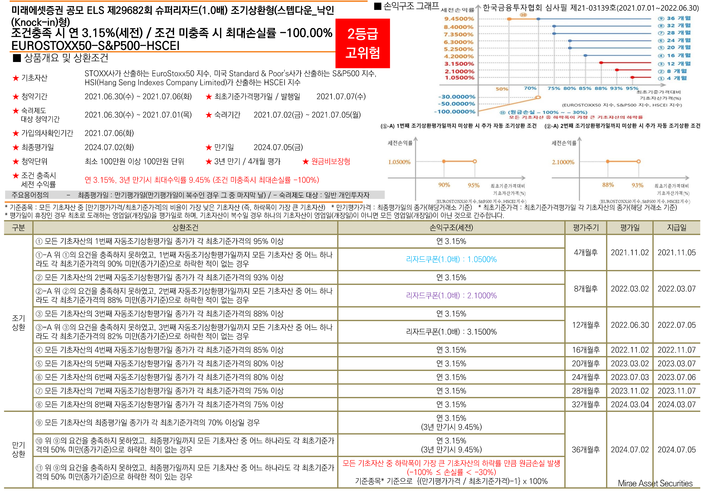

## Description
### ELS(Equity Linked Securities) 상품 공정가치 산출모형 코드

미래에셋 제29682회파생결합증권(주가연계증권)의 기초자산 정보 및 상환조건을 적용한 Matlab 산출모형을 구현하였다.

해당 모형에서 산출되는 공정가치는 해당 ELS 상품의 투자시점 현재가치 기댓값으로, 몬테카를로(Monte-Carlo) 방식으로 10만번 무작위 시행한 결과를 평균한 값이다.

매 시행마다 백분율로 환산한 기초자산의 변동을 블랙숄즈(Black-Scholes) 모형으로 무작위 생성하여 아래 상품구조에 따른 조건에 따라 상환액을 산출하고 시점에 따라 할인한다. 

*출처: 미래에셋증권 홈페이지 ELS/DLS 검색 서비스

미래에셋증권에서 공개한 해당 상품의 [자세한 상품설명서는 이 링크](https://securities.miraeasset.com/public/editor/elsdls/1624950655029.pdf)에서 확인할 수 있다.

*본 프로젝트는 2021-2학기 고려대학교 'FNEG211 사회과학도를 위한 계량금융' 수업의 기말과제 코드에 일부 기능을 추가한 것이다.

## Environment 

> Matlab 25.1.0.2952844 (R2025a)*

*가장 최근 확인된 작동 버전, Matlab Onlie 기준

## Files

`Mirae29682_FairValue.m` Main (as Matlab Script File)

## Usages

주가 생성 경향 파악을 위해 시뮬레이션 내 총 5번 생성 결과 그래프를 출력한다. 

그래프는 3개의 기초자산가격 변동을 나타내며 상환조건의 기준이 되는 각 시점별 기준가격대비 최저수준을 강조한다.

실행 결과 공정가치는 랜덤시드 값을 고정하지 않았으므로 매 시행마다 결과값이 일부 변동하나, 대체로 액면가 10,000원 기준 8,950원 내외로 산출된다.
